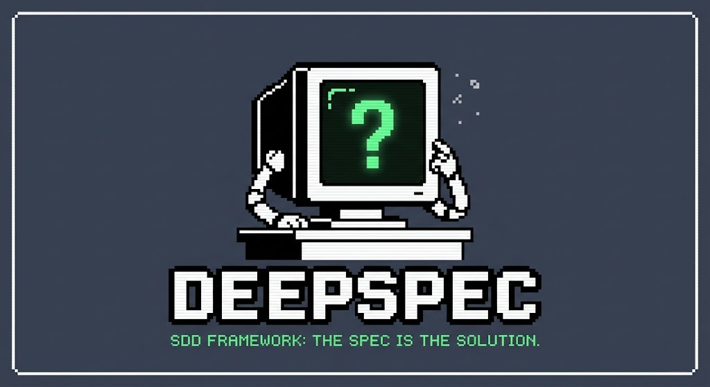

# DeepSpec 🖥️
**SDD Framework: The Spec is the Solution.**

DeepSpec is a zero-ceremony, AI-native Spec-Driven Development (SDD) framework. It eliminates architectural obesity and bureaucracy by acting as the "positronic brain" for your project, guiding both human developers and AI agents (like Cursor, Copilot, or Cline) from intention to implementation.

## The Philosophy
- **Auto-Sizing:** Not every task needs architecture. DeepSpec automatically sizes tasks (`small`, `medium`, `large`). Small fixes skip the design phase entirely.
- **Context Diet:** AI agents hallucinate when fed too much data. DeepSpec enforces a strict loading order (`kernel.md` -> `memory.md` -> `current-spec.md`) to keep the context window lean and focused.
- **Zero Ceremony:** No endless subfolders. Just a flat `.deepspec` directory acting as the single source of truth.

## Project Structure
```text
.deepspec/
├── kernel.md       # The core (Tech stack, AI rules, project conventions)
├── memory.md       # The hippocampus (ADRs, tech debt, past mistakes)
└── specs/          # The lifecycle
    ├── feature-a.md
    └── bugfix-b.md
```

## Installation (AI Agent Skill)
DeepSpec doesn't require npm packages. It runs directly in your IDE's AI agent. 

To install, add the skill located in `Skills/deep-spec/SKILL.md` to your preferred AI assistant.

## The Workflow
1. **Trigger**: Tell your AI: *"Create a feature to [do X]"*.
2. **Specify**: The AI creates the `.deepspec/specs/feature.md` file and infers the size.
3. **Review**: You read the spec. If it looks good, change `status: draft` to `status: approved`.
4. **Execute**: The AI writes the code strictly to pass the `[ACCEPTANCE]` criteria.
5. **Close**: The AI marks the spec as `done` and links the commit/PR.
```
